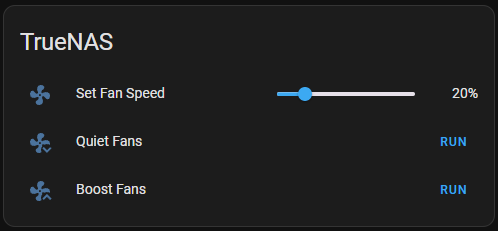

# What is this?

This project is a simple Node.js application that uses [Express](https://expressjs.com/) to expose a REST API that allows you to control the fan speed of an IPMI-enabled server.
To do that, it uses the [ipmi-tool](https://github.com/ipmitool/ipmitool) command line tool.

# Motivation

I needed a simple way to control the fan speed of my server through [Home Assistant](https://www.home-assistant.io/). To do that, I use [RESTful_command](https://www.home-assistant.io/integrations/rest_command) and an [Input number Helper](https://www.home-assistant.io/integrations/input_number/).



# How do I use it?

Send a POST request to `http://<server>:<port>/fanspeed` with a JSON body like this:
```json
{ "speed_pct": 50 }
```

Alternatively, you could use a GET request and pass the speed as a query parameter:
```
http://<server>:<port>/fanspeed/50
```

It is also possible to check the current fan speed by sending a GET request to `http://<server>:<port>/fanspeed` or `http://<server>:<port>/fanspeed/all`. The response will be of the form:
```json
{"id": 1, name: "Fan1", "rpm":4200,"percent":16}
```
where `percent` is the percentage of IPMI_MAX_FAN_SPEED that the fan speed was set to, and `rpm` is the actual RPM value.
`fanspeed/` will return the speed of Fan1, and `fanspeed/all` will return all fans.

Note: When setting the fan speed, the fan speed for all fans is set to the same value as a percentage of IPMI_MAX_FAN_SPEED (see .env.example).

# How do I install it?

1. Clone this repository and `cd` into it:
```bash
git clone https://github.com/irobot/ipmiserv.git && cd ipmiserv
```

2. Copy .env.example to .env, edit the values in it (see below) and save it:
```bash
  cp .env.example .env
  nano .env
```

# How do I run it?

## Using docker compose (recommended)

To run the application using docker compose:
```bash
docker compose up -d
```

## Running directly on the host machine

1. Install ipmitool, node, and pnpm (or npm):
    ```bash
    sudo apt update
    sudo apt install ipmitool nodejs
    npm install -g pnpm
    ```

2. Install dependencies using pnpm (recommended), and run:
    ```bash
    pnpm i --prod --frozen-lockfile
    p build && node dist/server.js
    ```

    Or using npm instead of pnpm:
    ```bash
    npm i --prod
    npm build && node dist/server.js
    ```

# What do I need to configure?

The following environment variables are required:

* `IPMI_HOST`: The hostname or IP address of the server that you want to control.
* `IPMI_USERNAME` and `IPMI_PASSWORD`: The username and password for the BMC (Baseboard Management Controller) on the server.
* `IPMI_MAX_FAN_SPEED`: The maximum fan speed in RPMs, as reported by ipmitool. Default is 18740.

The following environment variables are optional:
* `PORT`: The port that the application should listen on. Default is 3000. If using a docker container, the actual port exposed on the host machine will be configured in `docker-compose.yml`.