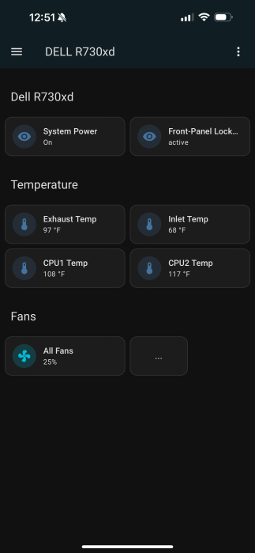

# What is this?

A service that exposes fan speed sensors and controls, temperature readings and power-on status of an IPMI-enabled server over MQTT and REST.
It uses the [ipmitool](https://github.com/ipmitool/ipmitool) CLI tool to communicate with a server's IPMI interface.
If MQTT is enabled in Home Assistant, it can use auto-discovery to add the sensors and controls to Home Assistant automatically.

# Motivation

I needed a simple way to control the fan speed of my server through [Home Assistant](https://www.home-assistant.io/) and monitor its temperature and power status.
With MQTT auto-discovery, entities are created automatically, without the need for any other integrations. Then I can add them to relevant dashboards and automations.




# Usage

## MQTT

1. Make sure you have the [MQTT integration](https://www.home-assistant.io/integrations/mqtt) configured in Home Assistant.
2. Edit the `.env` file to point to your MQTT broker. (see [Installation](#Installation))
3. Start the server and activate MQTT auto-discovery:
    ```bash
    curl -X PUT http://<server>:<port>/hass/discovery/do
    ```
    What this does is send a discovery request to Home Assistant, which will add all sensors and controls as entities in Home Assistant.
4. See the newly added entities in Home Assistant: navigate to `Settings > Devices and Services > MQTT`. You should see a new device added with the name of your server and all sensors and controls listed under it.
5. Profit.
6. (Optional) If you need to remove the auto-discovered device and entities from Home Assistant, send this request to the server:
    ```bash
    curl -X PUT http://<server>:<port>/hass/discovery/undo
    ```

> If you don't care about Home Assistant, you can still listen to the IPMI topics. While the messages are formatted with Home Assistant in mind, they are plain JSON, so you can use any MQTT client to subscribe to and process them as needed.

## REST API

### Setting the fan speed

Send a POST request to `http://<server>:<port>/fanspeed/set` with a JSON body like this:
```json
{ "speed_pct": 50 }
```
This sets the speed of all fans to 50% simultaneously.

Alternatively, you could use a GET request and pass the speed as a query parameter:
```
http://<server>:<port>/fanspeed/set/50
```

> Note: The fan speed for all fans is set to the same percentage value (see `.env.example`).

### Getting the fan speed

To check the current fan speed, send a GET request to `http://<server>:<port>/fanspeed` or `http://<server>:<port>/fanspeed/all`. The response will be of the form:
```json
{"id": 1, "name": "Fan1", "rpm":4200,"percent":16}
```
where `percent` is the percentage of the maximum fan speed, and `rpm` is the actual RPM value.
`fanspeed/` will return the speed of Fan1, and `fanspeed/all` will return all fans.

### Others

Here's the full list of the currently supported endpoints:

| Method | Endpoint | Description |
|-----|-----------|-----------------------|
| GET | /fanspeed | Get fan speed of Fan1 |
| GET | /fanspeed/all | Get fan speed of all fans |
| GET | /fanspeed/set/<percent> | Set fan speed of all fans to <percent>% (0-100) |
| POST | /fanspeed/set | Set fan speed of all fans (see body) |
| GET | /temperature/all | Get current reading of all temperature sensors |
| GET | /dell/fan-control-override/ | Get current fan control override status |
| GET | /dell/fan-control-override/[enable disable] | Set fan control override status |
| GET | /device/info | Get basic information about the server (model, serial number etc.) |
| PUT | /hass/discovery/do | Send discovery request to Home Assistant |
| PUT | /hass/discovery/undo | Remove auto-discovered Home Assistant entities |

# Installation

1. Clone this repository and `cd` into it:
```bash
git clone https://github.com/irobot/ipmi-mqtt.git && cd ipmi-mqtt
```

2. Copy `.env.example` to `.env`, edit the values in it and save it:
```bash
  cp .env.example .env
  nano .env
```

# Configuration

The following environment variables are required in the `.env` file:

* `IPMI_HOST` - The hostname or IP address of the server that you want to control.
* `IPMI_USERNAME` and `IPMI_PASSWORD` - The username and password for the BMC (Baseboard Management Controller) on the server.
* `IPMI_MAX_FAN_SPEED` - The maximum fan speed in RPMs, as reported by ipmitool. Default is 17280.
* `IPMI_MIN_FAN_SPEED` - The minimum fan speed in RPMs, as reported by ipmitool. Default is 1680.

If using MQTT:
* `ENABLE_MQTT=true`
* `MQTT_URL` - MQTT broker URL and port to publish sensor data to.
* `MQTT_USER`
* `MQTT_PASSWORD`

Additional optional settings are available in `.env.example`.

# Running the server

## Using docker compose (recommended)

To run the application using docker compose:
```bash
docker compose up -d
```

## Running directly on the host machine

1. Install ipmitool, node, and pnpm (or npm):
    ```bash
    sudo apt update
    sudo apt install ipmitool nodejs
    npm install -g pnpm
    ```

2. Install dependencies using pnpm (recommended), and run:
    ```bash
    pnpm i --prod --frozen-lockfile
    p build && node dist/server.js
    ```

    Or using npm instead of pnpm:
    ```bash
    npm i --prod
    npm build && node dist/server.js
    ```

# Development

Clone and install dependencies as above.

```bash
git clone https://github.com/irobot/ipmi-mqtt.git && cd ipmi-mqtt
```

Then run `pnpm dev` or `npm run dev`. This will start the server with automatic reloading on changes to source files.

```bash
pnpm i
pnpm dev
```

## Testing

```bash
pnpm test
```